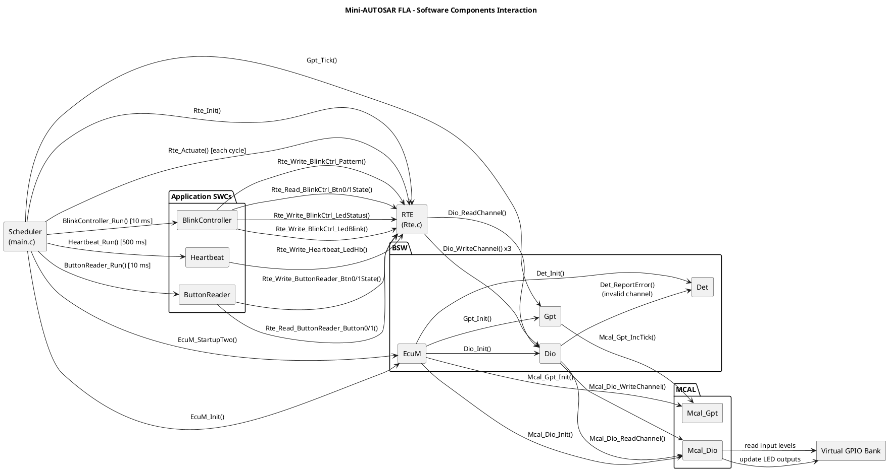

# Software Components Interaction Diagram

Rendered image:

PlantUML source (`software_components_interaction.puml`):

```plantuml
@startuml
title Mini-AUTOSAR FLA - Software Components Interaction

skinparam componentStyle rectangle
left to right direction

package "Application SWCs" {
  component "ButtonReader" as ButtonReader
  component "BlinkController" as BlinkController
  component "Heartbeat" as Heartbeat
}

component "Scheduler\n(main.c)" as Scheduler
component "RTE\n(Rte.c)" as RTE

package "BSW" {
  component "EcuM" as EcuM
  component "Dio" as Dio
  component "Gpt" as Gpt
  component "Det" as Det
}

package "MCAL" {
  component "Mcal_Dio" as McalDio
  component "Mcal_Gpt" as McalGpt
}

component "Virtual GPIO Bank" as GpioBank

' Startup interaction
Scheduler --> EcuM : EcuM_Init()
EcuM --> McalDio : Mcal_Dio_Init()
EcuM --> McalGpt : Mcal_Gpt_Init()

Scheduler --> EcuM : EcuM_StartupTwo()
EcuM --> Det : Det_Init()
EcuM --> Dio : Dio_Init()
EcuM --> Gpt : Gpt_Init()

Scheduler --> RTE : Rte_Init()

' Runtime interaction
Scheduler --> Gpt : Gpt_Tick()
Gpt --> McalGpt : Mcal_Gpt_IncTick()

Scheduler --> ButtonReader : ButtonReader_Run() [10 ms]
ButtonReader --> RTE : Rte_Read_ButtonReader_Button0/1()
RTE --> Dio : Dio_ReadChannel()
Dio --> McalDio : Mcal_Dio_ReadChannel()
McalDio --> GpioBank : read input levels
ButtonReader --> RTE : Rte_Write_ButtonReader_Btn0/1State()

Scheduler --> BlinkController : BlinkController_Run() [10 ms]
BlinkController --> RTE : Rte_Read_BlinkCtrl_Btn0/1State()
BlinkController --> RTE : Rte_Write_BlinkCtrl_LedStatus()
BlinkController --> RTE : Rte_Write_BlinkCtrl_LedBlink()
BlinkController --> RTE : Rte_Write_BlinkCtrl_Pattern()

Scheduler --> Heartbeat : Heartbeat_Run() [500 ms]
Heartbeat --> RTE : Rte_Write_Heartbeat_LedHb()

Scheduler --> RTE : Rte_Actuate() [each cycle]
RTE --> Dio : Dio_WriteChannel() x3
Dio --> McalDio : Mcal_Dio_WriteChannel()
McalDio --> GpioBank : update LED outputs

' Error tracing path
Dio --> Det : Det_ReportError()\n(invalid channel)

@enduml
```
